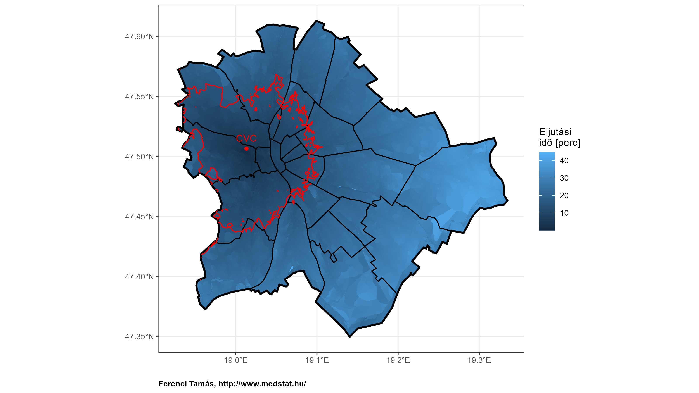
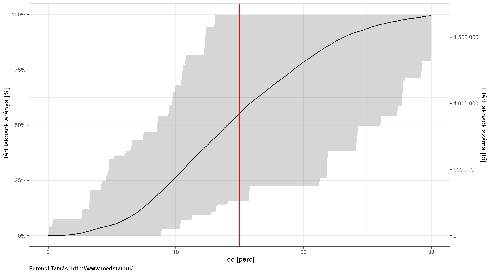
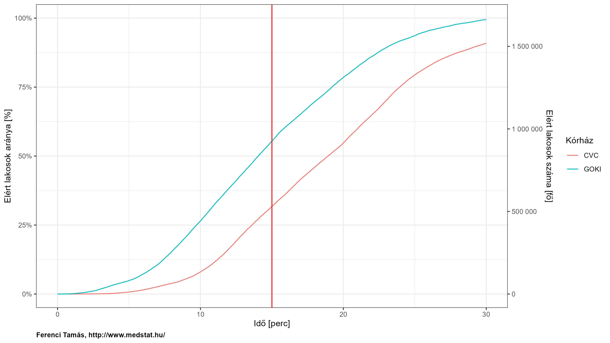
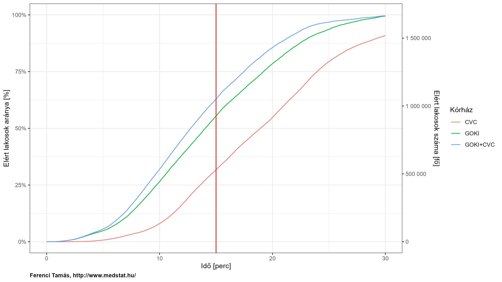

Budapesten belüli közúti elérhetőség
================
Ferenci Tamás (<https://www.medstat.hu/>)

- [Összefoglaló](#összefoglaló)
- [Kérdésfeltevés](#kérdésfeltevés)
- [Munkamódszer](#munkamódszer)
- [Eredmények](#eredmények)
- [Továbbfejlesztési lehetőségek](#továbbfejlesztési-lehetőségek)
- [Technikai részletek](#technikai-részletek)
  - [Az adatok forrása](#az-adatok-forrása)
  - [Döntés a rács használata
    mellett](#döntés-a-rács-használata-mellett)
  - [Az útvonaltervezés végrehajtása](#az-útvonaltervezés-végrehajtása)
  - [Az adatok összekapcsolása](#az-adatok-összekapcsolása)

## Összefoglaló

- Egy [korábbi
  munkámban](https://github.com/tamas-ferenci/MagyarorszagKozutiElerhetoseg)
  azt vizsgáltam, hogy a különböző magyarországi települések között
  milyen gyorsan lehet elérni közúton. Ugyanez a kérdés felvethető egy
  településen belül is; itt most azt az esetet fogom megvizsgálni, ami
  talán a legkézenfekvőbb: a Budapesten belüli elérhetőséget.
- A felvethető feladatok közül most egyre fogok fókuszálni: adott címtől
  való távolságokat fogom Budapest teljes területére kiszámolni. Hogy a
  dolgot izgalmasabbá tegyük, legyen ez a cím egy olyan kórház, ahová
  ügyeleti időben a szívinfarktusos betegeket kell szállítani egész
  Budapestről.
- Honnan fog a mentőautó beérni 5 percen belül? 10 percen belül? És
  legrosszabb esetben 15 percen belül? Mindenhonnan? Ha nem, akkor
  honnan nem? Ezzel egyenértékűen: hová jut el egy mentőautó a kórházból
  indulva 15 percen belül? Továbbmenve, mekkora lakosságszám az, akivel
  be lehet érni 15 percen belül, és hány budapesti van, akivel nem? Mi
  történne, ha még egy kórházat bekapcsolnánk az ügyelet-adásba? Mennyit
  javulna az elérhetőség? Jelen dolgozatban e kérdésekre igyekszem
  válaszolni.
- Az összes számításomat és eredményemet teljesen transzparensen közlöm:
  mind a nyers adatokat megadom, mind a kódokat valamennyi számítás
  mögött, melyek együtt lehetővé teszik munkám teljes reprodukálását és
  ellenőrzését. A dolgozat végén több továbbfejlesztési lehetőségre,
  további érdekes kutatási irányra is utalok.

## Kérdésfeltevés

Egy [korábbi
munkámban](https://github.com/tamas-ferenci/MagyarorszagKozutiElerhetoseg)
azt vizsgáltam, hogy a különböző magyarországi települések között milyen
gyorsan lehet elérni közúton; az így létrehozott adatbázis számos
érdekes kérdés vizsgálatát tette lehetővé, amiket be is mutattam az
írásomban (adott településről milyen messze van az összes többi, melyik
a két legtávolabbi magyar település, mennyi idő alatt lehet a
leggyorsabban az összes magyar települést végigjárni, hová telepítsünk
kórházakat, hogy az átlagos eljutási idő a legkisebb legyen az ország
bármely településéről stb.).

Ugyanez a kérdés feltehető természetesen nem csak települések között,
hanem egy településen belül is; minél nagyobb a település annál
relevánsabb a kérdés. Itt most azt az esetet fogom megvizsgálni, ami
ennél fogva a legkézenfekvőbb: a Budapesten belüli elérhetőséget.

Szigorúan véve ez esetben a településeket az egyes címek (utca/házszám)
helyettesítenék, azaz ezek között kellene – az összes lehetséges párra –
a távolságokat meghatározni. A gond az, hogy ilyen címből egyrészt
hihetetlenül sok van, másrészt a forrásul használt digitális térkép nem
is rendelkezik teljes listával az összesről. Emiatt én ezen megközelítés
helyett most egy más stratégiát választottam: nem minden egyes címet,
hanem egy elég sűrű négyzetrácsot fogok használni, e célból ráfektetek
Budapestre egy nagyjából 60 x 60 méteres rácsot, és ezek rácspontjai
(pontosabban szólva a hozzájuk legközelebb eső címek) között számolok
távolságokat. Látható, hogy a pontosságbeli veszteség gyakorlatilag
nulla – ha minden egyes címhez nem is számolunk, de minden címhez 30
méteren belül lesz olyan pont, amihez igen – és cserében egy kezelhető
problémát kapunk.

A felvethető feladatok közül most egyre fogok fókuszálni: adott címtől
való távolságokat fogom Budapest teljes területére kiszámolni. Hogy a
dolgot izgalmasabbá tegyük, legyen ez a cím az északi szélesség 47,48
fok, keleti hosszúság 19,08 fok. Hogy ez miért izgalmas? Azért, mert ez
épp a Gottsegen György Országos Kardiológiai Intézet (GOKI) címe, és e
sorok írásának pillanatában, ha valaki Budapest területén infarktust kap
– és olyan infarktusa van, amit egy speciális centrumban célszerű
kezelni – akkor mindenkit, Budapest teljes területéről a GOKI-ba kell
szállítani. (Az „e sorok írásának pillanatában” megjegyzés január 25
estére utal: Budapesten 5 kórház [egymást
váltva](https://www.mentok.hu/wp-content/uploads/2023/12/2024.-e%CC%81vi-beutala%CC%81si-rend-jav20231201.pdf)
ad ügyeletet erre a típusú infarktusra.) Igen ám, de honnan fog a
mentőautó beérni 5 percen belül? 10 percen belül? És legrosszabb esetben
15 percen belül? Mindenhonnan? Ha nem, akkor honnan nem? Szimmetrikusnak
véve az eljutási időket, ezek a kérdések természetesen meg is
fordíthatóak: hová jut el egy mentőautó a kórházból indulva 15 percen
belül? A kérdés egyenértékű a szimmetrikus esetben, úgyhogy a válasz is
ugyanaz lesz. Továbbmenve, mekkora lakosságszám az, akivel be lehet
érni, illetve akit el lehet érni 15 percen belül, és hány budapesti van,
akivel nem? Mi történne, ha még egy kórházat bekapcsolnánk az
ügyelet-adásba? Mennyit javulna az elérhetőség? Jelen dolgozatban e
kérdésekre igyekszem válaszolni.

## Munkamódszer

A kérdést a [korábbi
munkámhoz](https://github.com/tamas-ferenci/MagyarorszagKozutiElerhetoseg)
nagyon hasonló módon oldottam meg, így itt csak egészen rövid foglalom
össze a munkamódszert, minden másban utalok az ott leírtakra.

A térképadatok forrása az
[OpenStreetMap](https://www.openstreetmap.org/) (röviden OSM) nevű
ingyenes, nyílt, közösségi együttműködésben fejlesztett térkép volt, az
optimális útvonaltervezést pedig az [Open Source Routing
Machine](https://project-osrm.org/) (röviden OSRM) nevű ingyenes, nyílt
forráskódú programmal végeztem. Az OSRM meg tudja határozni bármely két
pont között a legjobb utat a térképadatok figyelembevételével, így épp
azt a feladatot oldja meg, amire nekünk szükségünk van. Ezzel
kapcsolatban azonban van pár nagyon fontos megjegyzés:

- Az OSRM menetidőre, és nem távolságra optimalizálja az utat, magyarán
  mindig a leggyorsabb, és nem a legrövidebb utat keresi meg –
  szerencsére ez pont az, amire nekünk szükségünk van. (Elvileg ki lehet
  belőle távolságot is szedni, de az előbbiből fakadóan az a leggyorsabb
  út távolsága, nem a legrövidebb távolság lesz.)
- Az OSRM figyelembevesz útvonal jellemzőket (piros lámpák, fordulások
  stb.), de forgalmat *nem*. Ez azt jelenti, hogy a kapott eredmények
  forgalom nélkül értendőek! Másik oldalról viszont, a
  sebességkorlátozásokról tud. Na de mi a helyzet egy mentőautóval? Ez
  nem könnyű kérdés, mert egyrészt a megkülönböztető jelzés miatt
  valóban kevésbé számít az esetében a forgalom, bár azt azért nem lehet
  mondani, hogy semennyire sem, mint az itteni feltevés szerint, de
  másik oldalról, mehet gyorsabban is, mint egy autó. (Igaz, egy [nem
  túl régi OMSZ
  rendelkezés](https://www.mentok.hu/kolcsonos-odafigyelessel-elozzuk-meg-a-mentobaleseteket-az-a-leggyorsabb-mento-amelyik-oda-is-er-a-beteghez/)
  szerint csak kicsit gyorsabban: legfeljebb 30 km/h-val gyorsabban,
  mint ami egyébként engedélyezett lenne.) Ha tehát a szokásos
  személygépjármű-profilt használjuk – profilnak hívja az OSRM azt, ami
  meghatározza az útvonal-választás jellemzőit, például, hogy hol mehet
  a jármű, vagy, hogy mennyi a maximális engedélyezett sebesség – akkor
  két, de ellentétes irányban tévedünk: 80 helyett 50 km/h-ra limitáljuk
  a sebességet, viszont teljes forgalommentességet feltételezünk. Én
  most a mentőautó közlekedési módjának megragadásához egy roppant
  egyszerű, de talán nem teljesen irreális közelítéssel éltem:
  egyszerűen azt feltételeztem, hogy a kétféle tévedes pont kioltja
  egymást. Azaz, amennyivel valójában gyorsabb, az épp kompenzálja azt,
  hogy igazából azért lassítja a forgalom. Ez hozzávetőleges számításhoz
  elfogadhatónak tűnik, és azért nagyon kényelmes, mert így minden
  további nélkül a sima, készen elérhető, alapértelmezett
  személygépjármű-profil használható az útvonal-választáshoz. Fontos
  továbbfejlesztési lehetőség lehet azonban egy reális mentő-profil
  megalkotása.
- Az OSRM valójában soha nem használ címeket, csak koordinátákat. Ez
  meglepő lehet, hiszen a korábbi munkámban településekről volt szó,
  egyáltalán nem koordinátákról, de ha valaki jobban megnézi, akkor
  látni fogja, hogy ott [az
  történt](https://github.com/tamas-ferenci/MagyarorszagKozutiElerhetoseg#magyarorsz%C3%A1g-telep%C3%BCl%C3%A9seinek-adatai),
  hogy a települések térképadat szerinti területének vettem a
  középpontját, és ezt, mint koordinátát adtam át az OSRM-nek. (Ha
  valaki az OSRM honlapjára felmegy, akkor ott talál egy [online
  útvonal-tervezőt](https://map.project-osrm.org/), ami látszólag
  címeket is elfogad, de valójában az történik, hogy azon oldal kódjába
  bele van építve egy ún. geokódolás, ami első lépésben a beírt címet
  koordinátára váltja, tehát az OSRM itt is koordinátát kap
  ténylegesen.) Ez nekünk azonban most nem csak, hogy nem probléma, de
  kimondottan jól jön, hiszen a négyzetráccsal való lefedés miatt nekünk
  eleve is koordinátáink lesznek, nem címeink! Felmerülhet még az a
  kérdés, hogy mi van, ha a koordináta nem pontosan egy valós cím (hanem
  mondjuk az út közepe), de itt is szerencsénk van, mert az OSRM
  viselkedése olyan, ami pont számunkra is a legjobb: ilyen esetkben a
  legközelebbi valid címet használja.

Minden számítást az [R statisztikai
környezet](https://www.youtube.com/c/FerenciTam%C3%A1s/playlists?view=50&sort=dd&shelf_id=2)
alatt végeztem el, a kódokat – a transzparencia és a nyílt tudomány
jegyében – ez a dokumentum teljes egészében tartalmazza, amely a munkám
teljes reprodukálását is lehetővé teszi. Ezeket az egyes elemzéseknél
külön-külön is közölni fogom, ha valakit ez nem érdekel, a szürke
hátteres részeket nyugodtan ugorja át. A technikai részleteket,
beleértve az elemzéshez szükséges adatok előkészítését is, pedig egy
[külön fejezet](#technikai-részletek) mutatja be.

## Eredmények

Nézzük elsőként meg, hogy honnan lehet a GOKI-t 15 percen belül mentővel
elérni! Avagy, a szimmetrikusság feltételezése esetén ezzel
egyenértékűen: hová lehet a GOKI-ból elérni mentővel 15 percen belül. A
térképen színskála mutatja az elérési idő pontos értékét, a piros görbe
pedig a 15 perces határt, azaz a 15 perchez tartozó [izokrón
görbét](https://github.com/tamas-ferenci/MagyarorszagKozutiElerhetoseg#kis-t%C3%B6rt%C3%A9nelmi-kit%C3%A9r%C5%91-az-izokr%C3%B3n-t%C3%A9rk%C3%A9pek-kapcs%C3%A1n):

``` r
ggplot(RawData, aes(x = lon, y = lat)) + geom_raster(aes(fill = durationGOKI/60)) +
  geom_sf(data = Budapest, inherit.aes = FALSE, fill = NA, linewidth = 1, color = "black") +
  geom_sf(data = Keruletek, inherit.aes = FALSE, fill = NA, linewidth = 0.5, color = "black") +
  metR::geom_contour2(breaks = 15, aes(z = durationGOKI/60), color = "red") +
  geom_point(data = data.frame(lat = 47.47644805, lon = 19.08488340044373), color = "red") +
  geom_text(data = data.frame(lat = 47.47644805, lon = 19.08488340044373), aes(label = "GOKI"),
            vjust = -1, color = "red") +
  labs(x = "", y = "", fill = "Eljutási\nidő [perc]", caption = captionlab)
```

<!-- -->

(A piros vonal azért ilyen hektikus, mert a városi közlekedés
jellegzetességei miatt a közúti elérési idő nem tökéletesen lineáris:
elképzelhető, hogy egy pont fizikailag távolabb van a kórháztól, mégis
gyorsabb bejutni onnan, mint egy közelebbiből – ha ott pont megy egy jó
összeköttetést biztosító út.)

Ez a vizsgálat természetesen bármely más kórházra is elvégezhető. A
lényeg ugyan most a módszertan kifejlesztése, de mégis, pusztán az
illusztráció kedvéért nézzük meg még a városmajori Cardiovascularis
Centrumot (CVC), ami egy másik ellátó az ilyen típusú infarktusoknál:

``` r
ggplot(RawData, aes(x = lon, y = lat)) + geom_raster(aes(fill = durationCVC/60)) +
  geom_sf(data = Budapest, inherit.aes = FALSE, fill = NA, linewidth = 1, color = "black") +
  geom_sf(data = Keruletek, inherit.aes = FALSE, fill = NA, linewidth = 0.5, color = "black") +
  metR::geom_contour2(breaks = 15, aes(z = durationCVC/60), color = "red") +
  geom_point(data = data.frame(lat = 47.50662795, lon = 19.013053652224635), color = "red") +
  geom_text(data = data.frame(lat = 47.50662795, lon = 19.013053652224635), aes(label = "CVC"),
            vjust = -1, color = "red") +
  labs(x = "", y = "", fill = "Eljutási\nidő [perc]", caption = captionlab)
```

<!-- -->

Az embernek az a benyomása lehet, hogy a CVC-ből rosszabbak az
elérhetőségek mint a GOKI-ból. Mi most a módszertanra fókuszálunk, így a
konkrét kórházak és a konkrét konklúzió nem annyira fontos, de a
vizsgálati módszer igen: hogyan lehet egy ilyen kérdést adatokra
alapozottan elemezni?

A megoldáshoz kölcsönvesszük [azt az
ötletet](https://github.com/tamas-ferenci/MagyarorszagKozutiElerhetoseg#az-el%C3%A9r%C3%A9si-id%C5%91k-eloszl%C3%A1sa),
amit a korábbi elemzésben használtunk: azt fogjuk vizsgálni, hogy hány
lakos számára érhető el a kórház adott időn belül / hány lakos érhető el
a kórházból adott időn belül (megint csak, a szimmetrikusság
feltételezésével ez a kettő egyenértékű). Itt azonban van egy új
probléma, ami a korábbi, település-szintű vizsgálatnál még nem
jelentkezett. Ott ugyanis minden település vagy benne volt az adott idő
alatt elérhető halmazban vagy nem, és a számításhoz egyszerűen az
előbbiek lélekszámait kellett összeadni. Jelen esetben azonban zűrösebb
a helyzet, hiszen – mint a fenti ábrák is mutatják – az adott idő alatt
elérhető vonal simán kettévághat egy kerületet. Ilyenkor mit csináljunk?
Kerületen *belüli* információnk nincs a lakosság-szám eloszlásáról…
Sajnos nincs jobb ötletem, mint az egyszerű arányosítás: ha a kerület
területének mondjuk 35%-a esik a vonalon belülre (ezt a
térkép-információnk alapján ki tudjuk számolni), akkor azt mondjuk, hogy
a kerület lakosságának is 35%-a érhető el az adott időn belül. Ez persze
csak egy közelítés (fogalmazzuk meg azt is, hogy milyen feltevéssel élő
közelítés: azt mondja, hogy a kerületen belül állandó a népsűrűség);
sokkal jobbat azonban, további információ híján, nem tudunk tenni.
Pontosabban szólva egy dolgot azért tehetünk: minimumot és maximumot
tudunk számolni. Két dolog ugyanis biztos, egyrészt az, hogy azon
kerületeknél, amelyek *teljes egészében* a görbén belül vannak, biztos,
hogy az egész lakosság elérhető, másrészt az, hogy amik *teljes
egészében* kívül vannak, biztos, hogy egyetlen lakos sem érhető el. Ez
alapján az előbbi becsült arány kiegészíthető egy „ennyi minimum
elérhető bizonyosan” és egy „ennyinél több bizonyos nem érhető el”
típusú, immár nem becsült, hanem biztos határokkal.

Az elegancia kedvéért ezt egy lépésben számoljuk ki az összes kórházra:

``` r
TimeResult <- rbindlist(lapply(seq(0, 30, 0.1), function(time)
  melt(RawData, id.vars = c("Kerulet", "Pop"), measure.vars = c("durationGOKI", "durationCVC"))[
    , .(mean(value < time*60)), .(Kerulet, Pop, variable)][
    , .(time, min = sum(Pop[V1==1]), max = sum(Pop[V1>0]), mean = sum(Pop*V1)),
    .(variable = substring(variable, 9))]))
```

Ábrázoljuk az eredményeket a GOKI-ra; a szürke sávok mutatják az
említett biztos minimumot és maximumot (a piros vonal a 15 perces
határ):

``` r
ggplot(TimeResult[variable=="GOKI"],
       aes(x = time, y = mean/BpPop, ymin = min/BpPop, ymax = max/BpPop)) +
  geom_line() +  geom_ribbon(alpha = 0.2) +
  labs(x = "Idő [perc]", y = "Elért lakosok aránya [%]", caption = captionlab) +
  scale_y_continuous(label = scales::percent,
                     sec.axis = sec_axis(~ . * BpPop,
                                         name = "Elért lakosok száma [fő]",
                                         label = scales::label_number())) +
  geom_vline(xintercept = 15, color = "red")
```

<!-- -->

A korábbi munkámban [említett
limitáció](https://github.com/tamas-ferenci/MagyarorszagKozutiElerhetoseg#az-orsz%C3%A1g-k%C3%B6z%C3%A9ppontja-avagy-hov%C3%A1-telep%C3%ADts%C3%BCnk-k%C3%B3rh%C3%A1zat)
itt is érvényes: ez kizárólag a lélekszámot tükrözi, nem törődve azzal,
hogy a megbetegedések fellépésének nem biztos, hogy állandó a kockázata
Budapest területén belül, sőt, biztos, hogy nem állandó, hiszen függ az
életkori összetételtől, társbetegségek gyakoriságától, szocioökonómiai
helyzettől stb., melyek eltérnek kerületről-kerületre, vagy akár
kerületen belül is.

Ez a számítás mindenesetre bármely kórházra elvégezhető! Ábrázoljuk a
CVC eredményeit is, rögtön együtt a GOKI-val; az áttekinthetőség
kedvéért a minimum-maximum sávok nélkül:

``` r
ggplot(TimeResult, aes(x = time, y = mean/BpPop, ymin = min/BpPop, ymax = max/BpPop,
                       group = variable, color = variable)) +
  geom_line() +  labs(x = "Idő [perc]", y = "Elért lakosok aránya [%]", color = "Kórház",
                      caption = captionlab) +
  scale_y_continuous(label = scales::percent,
                     sec.axis = sec_axis(~ . * BpPop,
                                         name = "Elért lakosok száma [fő]",
                                         label = scales::label_number())) +
  geom_vline(xintercept = 15, color = "red")
```

<!-- -->

Láthatjuk, hogy csakugyan a GOKI-ból / GOKI-ba jobb az elérhetőség,
hiszen adott idő alatt több ember érhető el onnan/oda, mint a CVC-ből. A
fentiek ezt jól értelmezhetően mutatják, és megragadhatóvá teszik (ha
valaki szeretné, nyugodtan számolhat átlagot, mediánt, minimumot,
maximumot, kvantiliseket…).

Természetesen ez nem jelenti azt, hogy *mindenhonnan* jobb a GOKI –
értelemszerűen a CVC szomszédjából a CVC érhető el jobban. Ez azonban
elvezet egy másik gondolathoz: mi történne akkor, ha a GOKI és a CVC
*egyszerre* adna ügyeletet? Akkor hogyan alakulna az elérhetőség…? Ennek
megválaszolásához mindössze egy dolgot kell észrevenni, azt, hogy ekkor
egy adott pont elérhetősége a két kórház elérési ideje közül a *kisebb*.
Ezt használva már számolhatunk is:

``` r
RawData$`durationGOKI+CVC` <- pmin(RawData$durationGOKI, RawData$durationCVC)
```

Ábrázolva az eredményt térképen:

``` r
ggplot(RawData, aes(x = lon, y = lat)) + geom_raster(aes(fill = `durationGOKI+CVC`/60)) +
  geom_sf(data = Budapest, inherit.aes = FALSE, fill = NA, linewidth = 1, color = "black") +
  geom_sf(data = Keruletek, inherit.aes = FALSE, fill = NA, linewidth = 0.5, color = "black") +
  metR::geom_contour2(breaks = 15, aes(z = `durationGOKI+CVC`/60), color = "red") +
  geom_point(data = data.frame(lat = 47.47644805, lon = 19.08488340044373), color = "red") +
  geom_text(data = data.frame(lat = 47.47644805, lon = 19.08488340044373), aes(label = "GOKI"),
            vjust = -1, color = "red") +
  geom_point(data = data.frame(lat = 47.50662795, lon = 19.013053652224635), color = "red") +
  geom_text(data = data.frame(lat = 47.50662795, lon = 19.013053652224635), aes(label = "CVC"),
            vjust = -1, color = "red") +
  labs(x = "", y = "", fill = "Eljutási\nidő [perc]", caption = captionlab)
```

<!-- -->

Az elért lakosság-számok:

``` r
TimeResult <- rbindlist(lapply(seq(0, 30, 0.1), function(time)
  melt(RawData, id.vars = c("Kerulet", "Pop"),
       measure.vars = c("durationGOKI", "durationCVC", "durationGOKI+CVC"))[
    , .(mean(value < time*60)), .(Kerulet, Pop, variable)][
    , .(time, min = sum(Pop[V1==1]), max = sum(Pop[V1>0]), mean = sum(Pop*V1)),
    .(variable = substring(variable, 9))]))

ggplot(TimeResult, aes(x = time, y = mean/BpPop, ymin = min/BpPop, ymax = max/BpPop,
                       group = variable, color = variable)) +
  geom_line() +  labs(x = "Idő [perc]", y = "Elért lakosok aránya [%]", color = "Kórház",
                      caption = captionlab) +
  scale_y_continuous(label = scales::percent,
                     sec.axis = sec_axis(~ . * BpPop,
                                         name = "Elért lakosok száma [fő]",
                                         label = scales::label_number())) +
  geom_vline(xintercept = 15, color = "red")
```

<!-- -->

(Látszik, hogy a javulás nem olyan nagy, ami abból fakad, hogy a CVC és
a GOKI izokrón területei nagyban átfednek: a CVC csak kevés olyan részt
ad hozzá, ami nem volt a GOKI-ból is 15 perc alatt elérhető.)

Valójában a kórházak telepítését, ügyeletbe való bevonását természetesen
sok más tényező befolyásolja mint az elérhetőségi viszonyok (ennek egy
fontos aspektusáról egy [másik
írásomban](https://github.com/tamas-ferenci/GondolatokAMagyarKorhaziAdatokElemzeserolEsNehanyEgeszsegpolitikaiMegjegyzes)
hosszabban is beszéltem), de az ilyen információk is lényeges, adatokon
alapuló hozzájárulást jelentenek az ezzel kapcsolatos döntések optimális
meghozatalához.

Végezetül megjegyzem, hogy a fenti számítások alapjául szolgáló
adatbázist [RDS](RawData.rds) és [CSV](RawData.csv) formátumokban is
elérhetővé tettem, hogy megkönnyítsem a felhasználását más kutatásokban
is.

## Továbbfejlesztési lehetőségek

Felsorolok néhány lehetőséget, melyeket a fenti elemzés nem vizsgál, de
véleményem szerint érdekes továbbfejlesztési ötletek lehetnek:

- Valódi mentőautó-profil megalkotása. Az OSRM [részletes
  súgót](https://github.com/Project-OSRM/osrm-backend/blob/master/docs/profiles.md)
  ad a profilok megalkotásához (a meglevő profilok, például [az
  autó](https://github.com/Project-OSRM/osrm-backend/blob/master/profiles/car.lua)
  tanulmányozási is hasznos), ez alapján meg lehet kísérelni a fenti,
  nagyon egyszerű közelítésnél szofisztikáltabb mentőautó-profil
  megalkotását.
- A fentiekben mindössze két kórházat vizsgáltam, ez értelemszerűen
  kiterjeszthető tetszőleges számú kórházra. (Igazából ez a kettő is
  csak illusztrációként szerepelt – a munkám lényege a keretrendszernek
  magának a megalkotása volt.) Sőt, ha valaki nagyon elszánt, elvileg
  akár az összes kórházat is beviheti. Vagy akár az összes mentőállomást
  is!
- Ha megvan az összes kórház, akkor annak sincsen akadálya, hogy olyan
  vizsgálatot rakjunk össze, ami az egész [beutalási
  rend](https://www.mentok.hu/wp-content/uploads/2023/12/2024.-e%CC%81vi-beutala%CC%81si-rend-jav20231201.pdf)
  adatait is integrálja, azaz figyelembe veszi, hogy mikor kinek melyik
  kórházba kell eljutnia (adott betegséggel). Így akár összességében is
  lehet nyilatkozni a Budapesten belüli sürgősségi ellátás időbeli
  elérhetőségi lehetőségeiről.
- Még merészebb módon akár ennek az optimalizálási lehetőségei is
  vizsgálhatóak, hasonlóan ahhoz, ahogy a település-szintű vizsgálatnál
  tettem a [kórháztelepítési
  probléma](https://github.com/tamas-ferenci/MagyarorszagKozutiElerhetoseg#f%C3%BCggel%C3%A9k-a-k%C3%B3rh%C3%A1ztelep%C3%ADt%C3%A9s-megold%C3%A1sa-line%C3%A1ris-programoz%C3%A1ssal)
  kapcsán.
- A vizsgálat finomítása a tekintetben, hogy ne csak lélekszámot, hanem
  valós szükségletet használjon (tehát, hogy figyelembe vegye a
  területileg eltérő kockázatot) nagyon bonyolult kérdés, de talán egy
  egyszerű kiinduló-problémájával meg lehet birkózni nyilvánosan
  elérhető adatok alapján is: lekérve a KSH-tól a kerületek korfáját, és
  kiszedve a kardiológiai irodalomból az infarktus életkor-függését,
  hogyan lehet finomítani az elérhetőségi térképet, hogy jobban tükrözze
  a szükségletet, tehát azt, hogy az egyes kerületekben vélhetően mennyi
  infarktus fog történni?
- Most, hogy megvan a vizsgálat és a módszertan mind a települések
  közti, mind a településen belüli elérhetőségre, elképzelhető egy „több
  skálájú” elérhetőségi elemzés az országra, mely összekapcsolja a
  kettőt: települések szintjén indul, de adott településnél lemegy a
  településen belüli szintre.

## Technikai részletek

### Az adatok forrása

A térképadatok forrása, ugyanúgy, mint a [korábbi
munkámban](https://github.com/tamas-ferenci/MagyarorszagKozutiElerhetoseg),
az OpenStreetMap (OSM), egész pontosan annak egy ilyen adatok
szolgáltatására szakosodott [magyar
aloldala](https://data2.openstreetmap.hu/hatarok/index.php):

``` r
td <- tempdir()
download.file("http://data2.openstreetmap.hu/hatarok/kozighatarok.zip", "kozighatarok.zip")
unzip("kozighatarok.zip", exdir = td)

Telepulesek <- sf::st_read(paste0(td, "\\kozighatarok"), layer = "admin8")
Budapest <- sf::st_transform(Telepulesek[Telepulesek$NAME=="Budapest",], crs = "WGS84")
Keruletek <- sf::st_read(paste0(td, "\\kozighatarok"), layer = "admin9")
Keruletek <- Keruletek[Keruletek$NAME!="Alag",]
Keruletek$NAME <- paste0("Budapest ", stringi::stri_pad(as.numeric(as.roman(sapply(strsplit(
  Keruletek$NAME, ".", fixed = TRUE), `[`, 1))), 2, "left", 0), ". ker.")
Keruletek <- sf::st_transform(Keruletek, crs = "WGS84")
```

Pár apró javítást és beállítást teszünk (ebből kiemelendő, hogy
mindenhol WGS84 szerinti koordinátákat fogunk használni), illetve a
kerületek elnevezését egységesítjük.

Ezen kívül szükségünk lesz még a Központi Statisztikai Hivatal
[Helységnévtárának](https://www.ksh.hu/apps/hntr.main) az adataira,
azért, hogy később majd a kerületek lélekszámáról is legyen
információnk:

``` r
download.file("https://www.ksh.hu/docs/helysegnevtar/hnt_letoltes_2023.xlsx", "hnt_letoltes_2023.xlsx",
              mode = "wb")
HNTData <- data.table(readxl::read_excel("hnt_letoltes_2023.xlsx", skip = 2), check.names = TRUE)
BpPop <- sum(HNTData[Megye.megnevezése=="főváros"]$Lakó.népesség)
```

### Döntés a rács használata mellett

Bármilyen meglepő, de az OSM nem tartalmazza az összes budapesti címet.
Rengeteget igen, de nem az összeset, hasraütésszerű példaként az alábbi
ábra mutatja a problémát (ahol szerepel szám a háztömbnél, ott ismeri az
OSM a házszámot):

<figure>

<figcaption aria-hidden="true">Hiányzó házszámok a budapesti
OSM-térképen</figcaption>
</figure>

Látható, hogy bizonyos házszámok meg vannak adva, de sok nincsen. Más
területen, például a belvárosban, viszont az összes házszám ki van
osztva. Az OSM-ből az `osmconvert`
[függvény](https://wiki.openstreetmap.org/wiki/Osmconvert) használatával
könnyen lekérhetjük az összes kiosztott házszámot:

    osmconvert hungary-latest.osm.pbf --all-to-nodes --max-objects=100000000
    --csv="@oname @id @lat @lon addr:street addr:housenumber addr:city" -o=cimek.csv

Ebben a fájlban rengeteg olyan sor is lesz, amihez ténylegesen nem
tartozik házszám, ezeket el kell dobnunk, illetve pár esetben ugyanahhoz
a címhez több koordináta is tartozik, ezeknél vegyük a mediánt, majd az
így előkészített adatbázisból mentsük ki a budapesti adatokat:

``` r
RawData <- fread("cimek.csv")
RawData <- RawData[V5!=""]
RawData <- RawData[, .(lat = median(V3), lon = median(V4)), .(Telepules = V7, Utca = V5, Hazszam = V6)]
fwrite(RawData[Telepules=="Budapest"], "cimekBp.csv")
```

Ez alapján ábrázolhatjuk az OSM által ismert budapesti címeket:

``` r
CimekBp <- fread("cimekBp.csv")

ggplot(Budapest) + geom_sf() +
  geom_sf(data = Keruletek, color = "red") +
  geom_sf(data = sf::st_as_sf(CimekBp, coords = c("lon", "lat"), crs = "WGS84"), size = 0.1)
```

<!-- -->

Az összes címet, ami elvileg a „tökéletes” megvalósítása lenne a
feladatnak, tehét nem tudjuk lekérni. De igazából ez egyrészt akkor is
értelmetlen lenne, ha meg tudnánk tenni, másrészt viszont, szerencsére,
szükség sincs rá: értelmetlen lenne, mert akkora mennyiségű címről lenne
szó (a meglevő címek száma is 93641) ami kivitelezhetetlenül lassúvá
tenne bármilyen számítást, másrészt viszont szükség sincs rá, hiszen az
egymáshoz nagyon közeli címeknél, mondjuk az egymástól 10 méterre lévő
szomszédos házaknál, úgysem lesz érdemben más az útvonal-tervezés
eredménye.

És ebből jöhet az ötlet: tegyünk rá egy négyzetrácsot a Budapest
térképre, és annak rácspontjaiban számoljunk! Ha elég sűrű a rács,
mondjuk 100 m x 100 m alatti, akkor ezzel érdemi hibát nem vétünk,
viszont cserében kezelhetővé tesszük a problémát. Én, egyszerű
megoldásként a Budapestet befoglaló téglalapot 500 részre osztottam fel,
mindkét irányban:

``` r
BpSamp <- CJ(lon = seq(sf::st_bbox(Budapest)["xmin"], sf::st_bbox(Budapest)["xmax"], length.out = 500),
             lat = seq(sf::st_bbox(Budapest)["ymin"], sf::st_bbox(Budapest)["ymax"], length.out = 500))
BpSamp <- BpSamp[sf::st_intersects(sf::st_as_sf(BpSamp, coords = c("lon", "lat"), crs = "WGS84"),
                                   Budapest, sparse = FALSE)[,1]]
```

Mivel Budapest „elég négyzetes”, így ez nagyjából egy négyzetrácsot
eredményezett. A térbeli felbontás a két irányban 58.6 és 61.7 méter,
ami valószínűleg minden gyakorlati célra elégséges (ha mégsem lenne az,
a fenti 500 lecserélésével könnyen sűríthető).

Most, hogy megvannak a rácspontok, mindegyikre határozzuk meg, hogy
melyik kerülethez tartozik. Egyedül arra kell figyelni, hogy az OSM
térképen a Margitsziget egyik kerülethez sem tartozik – joggal, mert
2013 óta a főváros közvetlen igazgatása alá tartozik jogilag – de mi
most a kényelem kedvéért rendeljük a 13. kerülethez, ahová hagyományosan
tartozott (a dolognak különösebb jelentősége nincsen, hiszen ott alig
van állandó lakos):

``` r
BpSamp$Kerulet <- Keruletek$NAME[as.numeric(sf::st_intersects(sf::st_as_sf(
  BpSamp, coords = c("lon", "lat"), crs = "WGS84"), Keruletek))]
BpSamp[is.na(Kerulet)]$Kerulet <- "Budapest 13. ker."
```

Utolsó lépésként, most, hogy a kerületek is megvannak, tároljuk el a
lélekszámokat is:

``` r
BpSamp <- merge(BpSamp, HNTData[, .(Kerulet = Helység.megnevezése, Pop = Lakó.népesség)],
                by = "Kerulet", sort = FALSE)
```

(Észrevehető, hogy ezzel rengeteg információt feleslegesen tárolunk el:
minden kerület lélekszáma ugyanaz, úgyhogy bőven elég lenne az
illesztést később végrehajtani. Itt most feláldozunk memóriát a későbbi
kényelemért és futásidőért.)

A későbbi útvonaltervezéshez mentsük ki a pontok koordinátáit egy külön
fájlba, ugyanis ez lesz az útvonaltervező szkript bemenete:

``` r
fwrite(BpSamp[, .(lon, lat)], "osrmlocsBpGrid.csv")
```

### Az útvonaltervezés végrehajtása

Az útvonaltervezést, a [korábbihoz
hasonlóan](https://github.com/tamas-ferenci/MagyarorszagKozutiElerhetoseg#az-%C3%BAtvonaltervez%C3%A9s-v%C3%A9grehajt%C3%A1sa),
most is node.js szkript segítségével hajtottam végre. Egy különbséggel:
a magyarországi település-szintű számolásnál teljes mátrixot
számoltattam (az `osrm.table` segítségével), azaz minden pontból
meghatároztam az elérési időt mindegyik pontba, itt azonban ez
reménytelen feladat lenne. (Településből 3000 körüli van, budapesti
címből, még a rácspontos megoldással is, 144761.) Ennyi pont között
teljesen reménytelen lenne a mátrix-szerű számítás, szerencsére azonban
szükség sincs rá, legalábbis a kérdésfelvetésben szereplő problémához:
ha adott kórház elérhetőségét vizsgáljuk, akkor elég annak elérhetőségét
vizsgálni a többi pontból/ponthoz, nem kell mindegyik pontot
mindegyikkel kiszámolni. Ezt a fajta számítást az OSRM közvetlenül nem
támogatja (úgy, ahogy a mátrix-szerűt támogatja az `osrm.table`-lel),
úgyhogy jobb híján a két pont közötti számítást végrehajtó
`osrm.route`-ot kell használni, kézzel végighívva az összes releváns
párra (azaz a kórházra és az összes pontra). Ezt valósítja meg az alábbi
node.js szkript, mely bementként felhasználja az előző pontban kimentett
`osrmlocsBpGrid.csv` fájlt:

    const OSRM = require('osrm');
    const osrm = new OSRM('hungary-latest.osrm');
    const fs = require('fs');
    const { convertCSVToArray } = require('convert-csv-to-array');
    const { convertArrayToCSV } = require('convert-array-to-csv');

    var coordinatesin = fs.readFileSync('osrmlocsBpGrid.csv', 'utf-8')

    coordinatesin = convertCSVToArray(coordinatesin, {
      header : false,
      type: 'array',
      separator: ',',
    });

    // var kiindulo = [ [19.08488340044373, 47.47644805] ]; // GOKI
    var kiindulo = [ [19.013053652224635, 47.50662795] ]; // CVC
    var n = coordinatesin.length;
    var resduration = Array(n).fill(0);
    var resdistance = Array(n).fill(0);
    var itemsProcessed = 0;

    [...Array(n).keys()].forEach( (i) => {
        osrm.route({
            coordinates: kiindulo.concat([coordinatesin[i]])
        }, function(err, response) {
            resduration[i] = response.routes[0].duration;
            resdistance[i] = response.routes[0].distance;
            itemsProcessed++;
            if(itemsProcessed == n) {
                fs.writeFileSync('osrmdurationsBpGrid-CVC.csv', convertArrayToCSV([resduration]));
                // fs.writeFileSync('osrmdistancesBpGrid-CVC.csv', convertArrayToCSV([resdistance]));
            }
        });
    });

Annyit talán még érdemes megjegyezni, hogy itt, szemben a
település-szintű vizsgálattal, interpolációra nincsen szükség, mivel a
pontok nagyon sűrűn, és definíciószerűen egyenletesen vannak a térképen.

Az egyes kórházak koordinátái – amit itt is, és az eredmények között az
ábrázolásnál is használtunk – legegyszerűbben egy geokódolóból tudhatóak
meg, mint amilyen a [Nominatim](https://nominatim.openstreetmap.org/);
példának okáért itt látható a
[GOKI](https://nominatim.openstreetmap.org/ui/details.html?osmtype=W&osmid=249443568&class=amenity),
illetve a
[CVC](https://nominatim.openstreetmap.org/ui/details.html?osmtype=W&osmid=250781815&class=building).

### Az adatok összekapcsolása

A fenti szkript lefuttatásával kapott eredmény(ek) közvetlenül
betölthetőek. Tegyük ezt meg két kórházra (GOKI és CVC), és rögtön
kapcsoljuk is össze a rácspontok adataival (amelyekre vonatkoznak az
eljutási idők):

``` r
RawData <- cbind(BpSamp,
                 durationGOKI = t(fread("osrmdurationsBpGrid-GOKI.csv"))[,1],
                 durationCVC = t(fread("osrmdurationsBpGrid-CVC.csv"))[,1])
```

Ez a tábla tehát tartalmazza az eljutási időt minden rácspontból a két
vizsgált kórházba (valamint, a fentiek miatt, az összes későbbi
számításhoz szükséges adatot is).

Zárásként mentsük ki ezt mind RDS, mind CSV formátumban, hogy
megkönnyítsük az adataink mások által történő felhasználást:

``` r
saveRDS(RawData, "RawData.rds")
fwrite(RawData, "RawData.csv", dec = ",", sep =";", bom = TRUE)
```
